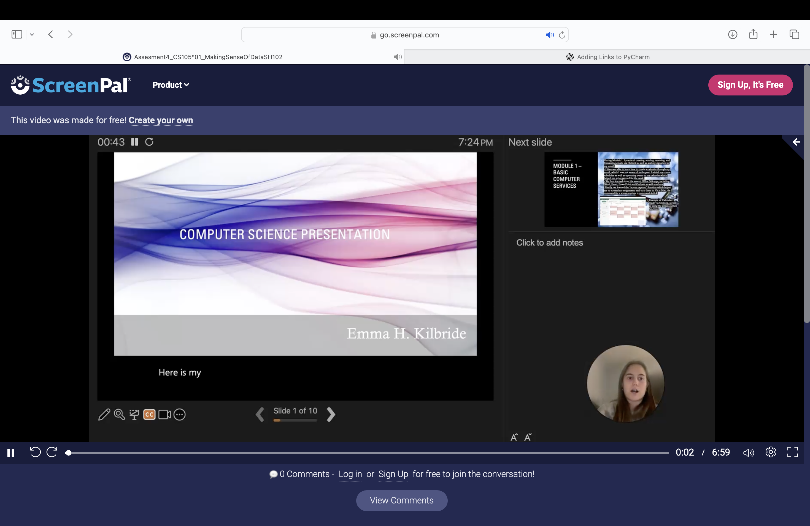

# CS105/6/7/8 Portfolio
# Emma Kilbride
## Portfolio
***

***
Contact Info:
Phone: 7327408388
Email: emmahkilbride@gmail.com
***

### About Me 
Hello! I am an experienced pharmaceutical professional with over 3 years of proven expertise in pharmaceutical sales.
With skills in communication, problem-solving, adaptability, and critical thinking, I am able to analyze marketing strategies,
and achieve improving sales in pharmaceuticals. I am adaptable with using computers, coding, and AI-driven analytics.
My experienced skill set, commitment to helping others, and passion for medicine makes me a valuable asset.
In my spare time, I like hiking and spending time with my family.
You can find me on LinkedIn, Instagram, and Facebook.

***

### Education 
Loyola University Maryland
Major: Bio-Health Commercialization
Graduation Year: 2028

***

## Projects

##  Video Recording

 - Video recording was done in Screen Pal. During the assignment, we created a slideshow.
 - The slideshow went over all the topics we learned within the first 2 weeks of the semester.
 - 
 - During the recording, I first discussed the first module covering basic computer services we went over.
 - I then discussed the files and directory structure which covers how to organize and sort files on your computer.
 - I included a discussion of the Binary Code and standardized coding methods discussed in class.
 - Finally, I compared Google, Microsoft, and Apple Ecosystems and their functions.

 - Link to Video Recording:(https://go.screenpal.com/watch/cOVuc5n33zb)
***
## Personality Test
 - I created a personality test using PyCharm that displays different questions to determine personality types of individual.
 - The personality test consisted of about 10 questions people can answer that determines what personality category they are a part of.
 - [Personality Test.png]
 - During The Personality Test, people can pick 4 answer options listed as A, B, C, and D
 - Depending on the answer you pick, your personality may be determined as extroverted, introverted, analytical, or creative
 - Once answering each question, you can run a code to determine the results and it will give you which personality you are closest associated with.
Link to Personality Test: https://github.com/LoyolaUnivMD/sp26-cs105-python-final-project-emmahkilbride
***
## Grade Calculator
 - During this assignment, we created a grade calculator using Excel.
 - This grade calculator included a pie chart that displays the weights of each assignment for each task and columns displaying each class and their assignment weights.

 - Using coding from excel, I determined what my final grade would be based on my scores in the class and how much they weighed.
 - I then plugged in a pie chart based on these results to visibly demonstrate the weight of each assignment in the class.
 - During this class, I gained a lot of insight on how excel works. 
 - Link to Excel: [AEmmaKilbride_ExcelAssesment_CS10501_1pm1.xltx](../../../Downloads/AEmmaKilbride_ExcelAssesment_CS10501_1pm1.xltx)
 - 
